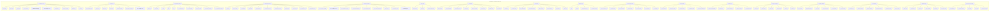

```mermaid
flowchart TB
    subgraph CUSTOMER["2. CUSTOMER - NGƯỜI MUA / NGUỒN CẦU"]
        direction TB

        %% Định nghĩa các module chính
        C1["2.1 Tài khoản & hồ sơ"]
        C2["2.2 Sổ địa chỉ"]
        C3["2.3 Khám phá sản phẩm"]
        C4["2.4 Bài viết & cộng đồng"]
        C5["2.5 Chiến dịch giải cứu"]
        C6["2.6 Yêu thích"]
        C7["2.7 Giỏ hàng"]
        C8["2.8 Checkout"]
        C9["2.9 Thanh toán"]
        C10["2.10 Quản lý đơn hàng"]
        C11["2.11 Vận chuyển"]
        C12["2.12 Đánh giá"]
        C13["2.13 Báo cáo vi phạm"]
        C14["2.14 Lịch sử giao dịch"]
        C15["2.15 Thông báo"]
        C16["2.16 Offline Mode"]
        C17["2.17 Xem hồ sơ cộng đồng"]

        %% 2.1 Tài khoản & hồ sơ
        C1 --> C1_01["Xem Profile"]
        C1 --> C1_02["Sửa họ tên"]
        C1 --> C1_03["Sửa avatar"]
        C1 --> C1_04["Sửa số điện thoại"]
        C1 --> C1_05["Cập nhật loại Customer (Cá nhân / Doanh nghiệp)"]
        C1 --> C1_06["Cập nhật thông tin doanh nghiệp"]
        C1 --> C1_07["Lấy GPS hiện tại"]
        C1 --> C1_08["Reverse Geocoding"]
        C1 --> C1_09["Đổi mật khẩu"]
        C1 --> C1_10["Đăng xuất"]

        %% 2.2 Sổ địa chỉ
        C2 --> C2_01["Xem danh sách địa chỉ"]
        C2 --> C2_02["Thêm địa chỉ"]
        C2 --> C2_03["Sửa địa chỉ"]
        C2 --> C2_04["Xóa địa chỉ"]
        C2 --> C2_05["Đặt địa chỉ mặc định"]
        C2 --> C2_06["Gắn Latitude / Longitude"]
        C2 --> C2_07["Chọn vị trí bằng Google Maps"]

        %% 2.3 Khám phá sản phẩm
        C3 --> C3_01["Xem Home"]
        C3 --> C3_02["Xem Category"]
        C3 --> C3_03["Search"]
        C3 --> C3_04["Filter"]
        C3 --> C3_05["Sort"]
        C3 --> C3_06["Xem Product Detail"]
        C3 --> C3_07["Xem ProductBatch"]
        C3 --> C3_08["Xem hạn sử dụng"]
        C3 --> C3_09["Xem giá gốc / giá giải cứu"]
        C3 --> C3_10["Xem khoảng cách tới Seller"]

        %% 2.4 Bài viết & cộng đồng
        C4 --> C4_01["Xem Feed"]
        C4 --> C4_02["Xem Post Detail"]
        C4 --> C4_03["React bài viết"]
        C4 --> C4_04["Bỏ Reaction"]
        C4 --> C4_05["Comment bài viết"]
        C4 --> C4_06["Sửa Comment của mình"]
        C4 --> C4_07["Xóa Comment của mình"]
        C4 --> C4_08["Xem Comment"]
        C4 --> C4_09["Xem lượt View"]
        C4 --> C4_10["Mở Product từ Post"]
        C4 --> C4_11["Mở Campaign từ Post"]

        %% 2.5 Chiến dịch giải cứu
        C5 --> C5_01["Xem danh sách Campaign"]
        C5 --> C5_02["Xem Campaign đang hoạt động"]
        C5 --> C5_03["Xem Campaign gần hết hạn"]
        C5 --> C5_04["Xem Campaign hoàn thành"]
        C5 --> C5_05["Xem mục tiêu sản lượng"]
        C5 --> C5_06["Xem sản lượng đã giải cứu"]
        C5 --> C5_07["Xem % tiến độ"]
        C5 --> C5_08["Xem thời gian còn lại"]
        C5 --> C5_09["Mua sản phẩm trong Campaign"]

        %% 2.6 Yêu thích
        C6 --> C6_01["Thêm Favorite"]
        C6 --> C6_02["Bỏ Favorite"]
        C6 --> C6_03["Xem danh sách Favorite"]

        %% 2.7 Giỏ hàng
        C7 --> C7_01["Thêm CartItem"]
        C7 --> C7_02["Chọn ProductBatch"]
        C7 --> C7_03["Tăng / giảm số lượng"]
        C7 --> C7_04["Xóa CartItem"]
        C7 --> C7_05["Chọn item Checkout"]
        C7 --> C7_06["Gom theo Seller"]
        C7 --> C7_07["Validate tồn kho"]
        C7 --> C7_08["Tính subtotal"]

        %% 2.8 Checkout
        C8 --> C8_01["Chọn địa chỉ"]
        C8 --> C8_02["Áp dụng Voucher"]
        C8 --> C8_03["Tính Shipping Fee"]
        C8 --> C8_04["Chọn Payment Method"]
        C8 --> C8_05["Nhập Order Note"]
        C8 --> C8_06["Kiểm tra lại tồn kho"]
        C8 --> C8_07["Tính tổng tiền"]
        C8 --> C8_08["Place Order"]

        %% 2.9 Thanh toán
        C9 --> C9_01["COD"]
        C9 --> C9_02["VNPAY"]
        C9 --> C9_03["Nhận Payment Result"]
        C9 --> C9_04["Xem Payment Status"]

        %% 2.10 Quản lý đơn hàng
        C10 --> C10_01["Xem danh sách Order"]
        C10 --> C10_02["Xem Order Detail"]
        C10 --> C10_03["Lọc theo trạng thái"]
        C10 --> C10_04["Theo dõi Timeline"]
        C10 --> C10_05["Hủy đơn khi hợp lệ"]
        C10 --> C10_06["Xem SellerOrder"]
        C10 --> C10_07["Xem OrderItem"]

        %% 2.11 Vận chuyển
        C11 --> C11_01["Xem mã vận đơn"]
        C11 --> C11_02["Xem Shipment Status"]
        C11 --> C11_03["Xem điểm xuất phát"]
        C11 --> C11_04["Xem điểm giao hàng"]
        C11 --> C11_05["Xem bản đồ Google Maps"]

        %% 2.12 Đánh giá
        C12 --> C12_01["Đánh giá sau DELIVERED"]
        C12 --> C12_02["Rating 1-5 sao"]
        C12 --> C12_03["Viết nội dung Review"]
        C12 --> C12_04["Upload ảnh Review"]
        C12 --> C12_05["Xem Review đã gửi"]

        %% 2.13 Báo cáo vi phạm
        C13 --> C13_01["Report Post"]
        C13 --> C13_02["Report Product"]
        C13 --> C13_03["Report Seller"]
        C13 --> C13_04["Report Review"]
        C13 --> C13_05["Chọn lý do"]
        C13 --> C13_06["Nhập mô tả"]

        %% 2.14 Lịch sử giao dịch
        C14 --> C14_01["Xem giao dịch"]
        C14 --> C14_02["Xem Payment Method"]
        C14 --> C14_03["Xem số tiền"]
        C14 --> C14_04["Xem Transaction ID"]
        C14 --> C14_05["Lọc theo thời gian"]
        C14 --> C14_06["Lọc theo trạng thái"]

        %% 2.15 Thông báo
        C15 --> C15_01["Thông báo Order"]
        C15 --> C15_02["Thông báo Payment"]
        C15 --> C15_03["Thông báo Shipment"]
        C15 --> C15_04["Thông báo Campaign"]
        C15 --> C15_05["Thông báo tương tác"]
        C15 --> C15_06["Đánh dấu đã đọc"]

        %% 2.16 Offline Mode
        C16 --> C16_01["Cache Home"]
        C16 --> C16_02["Cache Product"]
        C16 --> C16_03["Cache Post"]
        C16 --> C16_04["Cache Campaign"]
        C16 --> C16_05["Cache Order"]
        C16 --> C16_06["Sync khi có mạng"]

        %% 2.17 Xem hồ sơ cộng đồng
        C17 --> C17_01["Xem Profile Seller"]
        C17 --> C17_02["Xem Profile Customer"]
        C17 --> C17_03["Xem Rating"]
        C17 --> C17_04["Xem Post"]
        C17 --> C17_05["Xem Product Seller"]
    end
```
