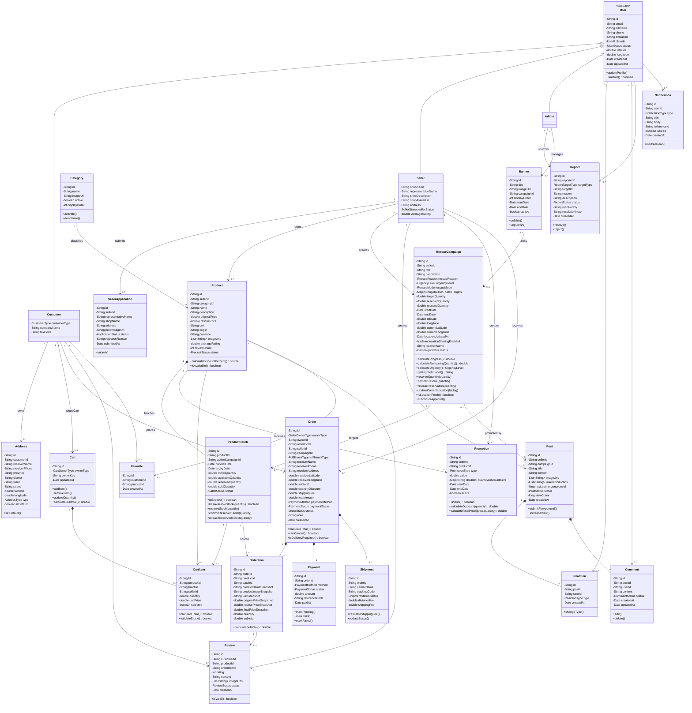

Tôi đã rà lại toàn bộ từ đầu theo 5 trục: **nghiệp vụ giải cứu**, **25 domain class**, **OOP**, **khả năng code trong 1–2 tháng**, và **tính nhất quán giữa Function → Use Case → Class → code architecture**. Sau lần review này, tôi **không giữ nguyên 100% bản bạn đưa**, vì có vài điểm nếu bắt đầu code ngay sẽ phát sinh sửa dây chuyền.

Kết luận quan trọng nhất là: **khung hiện tại đã đúng hướng, nhưng chưa nên đóng băng nếu chưa sửa 6 điểm dưới đây. Sau khi sửa 6 điểm này thì tôi đồng ý đóng model và bắt đầu code.**

---

# 1. Sáu chỉnh sửa cuối cùng tôi chốt

### 1. Campaign phải gắn với `ProductBatch`, không chỉ với `Product`

Đây là thay đổi quan trọng nhất.

Các lý do như:

- gần hết hạn;
- cần thu hoạch gấp;
- dư tồn của một đợt thu hoạch;
- đơn lớn bị hủy;
- hàng loại B;
- sự cố vận chuyển;

đều xảy ra với **một lô hàng cụ thể**, không phải với khái niệm Product chung.

Ví dụ:

```text
Product:
Xoài cát Hòa Lộc

Batch A:
500 kg
Thu hoạch 01/10
Hạn 08/10
→ CẦN GIẢI CỨU GẤP

Batch B:
300 kg
Thu hoạch 04/10
Hạn 14/10
→ bình thường
```

Nếu Campaign chỉ liên kết `Product`, hai batch sẽ bị đánh đồng.

Vì vậy source of truth phải là:

```text
RescueCampaign
    ↓
ProductBatch
    ↓
Product
```

Ta **không cần tạo lại `CampaignProduct`**.

Trong Campaign dùng:

```java
Map<String, Double> batchTargets;
```

Ví dụ:

```text
batchTargets:
{
   "batchA": 300,
   "batchB": 200
}
```

Vẫn giữ được 25 class.

---

### 2. Inventory phải có `reservedQuantity`

Bản cũ:

```text
initialQuantity
availableQuantity
soldQuantity
```

chưa đủ chắc.

Giả sử còn 10kg:

```text
Customer A đặt 10kg
Order = PENDING
```

Nếu chưa giảm stock thì Customer B vẫn mua được.

Nếu tăng `soldQuantity` ngay thì lại sai vì đơn A chưa hoàn thành.

Bản cuối:

```text
initialQuantity
availableQuantity
reservedQuantity
soldQuantity
```

Luồng:

```text
Checkout thành công
→ available - quantity
→ reserved + quantity

Order DELIVERED
→ reserved - quantity
→ sold + quantity

Order CANCELLED
→ reserved - quantity
→ available + quantity
```

Tương tự Campaign nên có:

```text
reservedQuantity
rescuedQuantity
```

Trong đó:

- `reservedQuantity`: đã có đơn nhưng chưa hoàn tất;
- `rescuedQuantity`: thực sự hoàn thành.

Điều này làm hệ thống chính xác hơn rất nhiều.

---

### 3. `rescuedQuantity` không được tăng khi vừa đặt hàng

Bản cũ có chỗ hơi mơ hồ.

Tôi chốt:

```text
Cart                       → không tính
Order PENDING              → không tính rescued
Order CONFIRMED/PREPARING  → reserved
Order CANCELLED            → bỏ reserved
Order DELIVERED            → rescued
On-site completed sale     → rescued ngay
```

Vậy Dashboard có thể đẹp hơn:

```text
Mục tiêu          1.000 kg
Đã giải cứu         620 kg
Đang được đặt giữ   110 kg
Còn khả dụng        270 kg
```

---

### 4. Phải thêm mô hình **giải cứu di động / trên đường**

Đây chính là feedback mới của giảng viên.

Không cần thêm actor `Shipper`.

Không cần realtime GPS background.

Không cần class thứ 26.

Ta đưa trực tiếp vào `RescueCampaign`.

Thêm:

```java
RescueMode rescueMode;
```

```java
enum RescueMode {
    FIXED_POINT,
    MOBILE_POINT
}
```

#### FIXED_POINT

Ví dụ:

```text
Giải cứu 2 tấn thanh long tại HTX Bình Thuận
```

Có vị trí cố định.

#### MOBILE_POINT

Ví dụ đúng tình huống thầy đưa:

> Người nông dân đang chở nông sản trên đường đi tiêu thụ. Người mua gần đó nhìn thấy điểm giải cứu trên app và dừng lại mua.

Campaign có thêm:

```text
currentLatitude
currentLongitude
locationUpdatedAt
locationSharingEnabled
```

Seller mở:

```text
Chế độ điểm giải cứu di động
```

App lấy vị trí hiện tại bằng `FusedLocationProviderClient`.

Customer thấy:

```text
🚚 ĐIỂM GIẢI CỨU ĐANG DI CHUYỂN

Dưa hấu Long An
Cách bạn 1,8 km

Còn 430 kg
Cập nhật vị trí 2 phút trước
```

Không track Seller 24/7.

Khi Seller đang mở màn hình Mobile Rescue:

```text
Seller
 ↓
Get Current Location
 ↓
Update Campaign location
 ↓
Firestore
 ↓
Customer refresh / realtime listener
```

Nếu:

```text
locationUpdatedAt > 10 phút
```

thì UI phải đổi từ:

```text
Đang ở gần bạn
```

thành:

```text
Vị trí gần nhất được cập nhật 12 phút trước
```

hoặc không đưa vào mục “Đang ở gần”.

Đây là cách **rất khả thi**, không cần background-location permission và không biến project thành Grab.

---

### 5. Order phải hỗ trợ ba cách nhận hàng

Thêm enum:

```java
enum FulfillmentType {
    DELIVERY,
    PICKUP,
    ON_SITE_RESCUE
}
```

#### DELIVERY

Luồng bình thường:

```text
Order
→ Shipment
→ SHIPPING
→ DELIVERED
```

#### PICKUP

Customer tự tới nông trại/HTX:

```text
Order
→ Seller xác nhận
→ Customer tới nhận
→ DELIVERED
```

Không cần Shipment.

#### ON_SITE_RESCUE

Chính là:

> “đi ngang đường rồi dừng lại mua”.

Luồng:

```text
Customer thấy Mobile Rescue Point
        ↓
Đến điểm bán
        ↓
Chọn số lượng
        ↓
Order fulfillment = ON_SITE_RESCUE
        ↓
Thanh toán tại chỗ
        ↓
Seller xác nhận
        ↓
DELIVERED
        ↓
Batch soldQuantity tăng
Campaign rescuedQuantity tăng
```

Vẫn dùng `Order`, không tạo `QuickSale`, `MobileSale`, `RoadsideSale`...

Đây là thiết kế tôi đánh giá rất sạch.

---

### 6. `User` tuyệt đối không chứa password

Trong một bản cũ có:

```java
passwordHash
```

Phải bỏ.

Vì dùng Firebase Authentication:

```text
Firebase Auth
→ quản lý credential

Firestore User
→ profile + role + status
```

Firestore không được lưu:

```text
rawPassword
passwordHash
```

---

# 2. Kết luận về giới hạn 25 class

Tôi **đồng ý giữ đúng 25 domain class**.

Nhưng có một điểm phải nói rõ khi trình bày với giảng viên:

> 25 class là **25 business/domain model trong Class Diagram**, không phải toàn bộ số file `.java` của source code.

Nếu tính:

```text
ViewModel
Repository
DAO
Adapter
Fragment
Service
Utility
```

thì source tất nhiên sẽ vượt 25 Java class.

Nếu cố ép **toàn project Android chỉ có 25 class** thì kiến trúc sẽ trở nên tệ hơn.

25 class nghiệp vụ cuối cùng:

| # | Domain class |
|---:|---|
| 1 | `User` |
| 2 | `Customer` |
| 3 | `Seller` |
| 4 | `Admin` |
| 5 | `Address` |
| 6 | `SellerApplication` |
| 7 | `Category` |
| 8 | `Product` |
| 9 | `ProductBatch` |
| 10 | `RescueCampaign` |
| 11 | `Post` |
| 12 | `Reaction` |
| 13 | `Comment` |
| 14 | `Promotion` |
| 15 | `Cart` |
| 16 | `CartItem` |
| 17 | `Order` |
| 18 | `OrderItem` |
| 19 | `Payment` |
| 20 | `Shipment` |
| 21 | `Review` |
| 22 | `Favorite` |
| 23 | `Report` |
| 24 | `Notification` |
| 25 | `Banner` |

**Không thêm class thứ 26.**

Guest là actor nhưng không phải persisted domain entity.

---

# 3. Domain giải cứu cuối cùng

Sau review, “giải cứu nông sản” của RescueFarm không còn chỉ là:

```text
Người bán đăng hàng
→ người mua đặt giao hàng
```

mà bao phủ **bốn kịch bản tiêu thụ**:

```text
1. Delivery rescue
   Người mua đặt → giao đến nhà

2. Pickup rescue
   Người mua đặt → tới nông trại/HTX lấy

3. Fixed rescue point
   Seller mở điểm giải cứu cố định

4. Mobile rescue point
   Seller đang vận chuyển/bán lưu động
   → cập nhật vị trí
   → người mua gần đó đến mua tại chỗ
```

Đây là cải tiến rất đáng giá vì nó trực tiếp xử lý feedback giảng viên.

---

# 4. Các tình huống giải cứu cuối cùng

Tôi giữ tám trường hợp trước và bổ sung cấu trúc giải thích rõ ràng hơn.

```java
enum RescueReason {
    OVER_SUPPLY,
    NEAR_EXPIRY,
    SEASONAL_HARVEST,
    WEATHER_IMPACT,
    ORDER_CANCELLED,
    LOGISTICS_DISRUPTION,
    DEMAND_DROP,
    COSMETIC_GRADE
}
```

Những lý do này có cơ sở nghiệp vụ hợp lý: FAO ghi nhận perishability, điều kiện nhiệt độ/độ ẩm, thiệt hại vật lý, thời tiết, vận chuyển, hạ tầng bảo quản, dư cung và biến động nhu cầu đều có thể góp phần tạo ra tổn thất nông sản. [FAOHome](https://www.fao.org/platforms/green-agriculture/areas-of-work/consumption-food-loss-and-waste/food-loss-and-waste/?utm_source=chatgpt.com)

Đặc biệt:

```text
LOGISTICS_DISRUPTION
```

rất phù hợp với tình huống “đang chở hàng trên đường nhưng đầu ra bị thay đổi”.

---

# 5. Rescue urgency cuối cùng

Không nên tính chỉ bằng `remainingDays`.

Nên xét cả:

```text
deadline
batch expiry
remaining quantity
```

Nhưng không cần AI.

Ví dụ rule:

```text
CRITICAL nếu:
- batch còn <= 2 ngày
HOẶC
- campaign còn <= 1 ngày và còn > 30% target

HIGH nếu:
- batch còn <= 5 ngày
HOẶC
- campaign còn <= 3 ngày

NORMAL:
- còn lại
```

Method nằm trong Campaign:

```java
UrgencyLevel calculateUrgency();
String getRescueLabel();
```

Badge:

```text
🔴 CẦN GIẢI CỨU GẤP
🟠 CẦN GIẢI CỨU SỚM
🟢 ĐANG GIẢI CỨU
🚚 ĐIỂM GIẢI CỨU DI ĐỘNG
📦 ĐƠN LỚN BỊ HỦY
🌧 CẦN THU HOẠCH GẤP
⏰ SẮP HẾT THỜI GIAN
```

---

# 6. Giá và volume discount

Phần này giữ.

Nhưng logic cuối nên là:

```text
baseOriginalPrice
        ↓
rescuePrice
        ↓
Promotion
        ↓
quantity tier
        ↓
finalUnitPrice
```

`Promotion`:

```java
Map<String, Double> quantityDiscountTiers;
```

Ví dụ:

```text
{
    "5": 5,
    "10": 10,
    "20": 15
}
```

Method:

```java
double calculateDiscount(double quantity);
double calculateFinalUnitPrice(
    double rescuePrice,
    double quantity
);
```

Ví dụ:

```text
Giá gốc:       40.000
Giá giải cứu:  30.000

>= 10 kg:
-10%

Final:
27.000/kg
```

Không cần Voucher riêng nữa.

Tôi giữ quyết định **bỏ Voucher**.

---

# 7. FUNCTION DIAGRAM — bản chốt

Đây mới đúng dạng **phân rã chức năng**, không phân actor.

```mermaid
mindmap
  root((RESCUEFARM<br/>HỆ THỐNG GIẢI CỨU NÔNG SẢN))

    1. Phát hiện và tổ chức nhu cầu giải cứu

      1.1 Xác định nguyên nhân
        Dư cung
        Gần hết thời gian bảo quản
        Thu hoạch đồng loạt
        Ảnh hưởng thời tiết
        Đơn lớn bị hủy
        Gián đoạn vận chuyển
        Suy giảm nhu cầu
        Hàng loại B vẫn an toàn

      1.2 Xác định lô cần giải cứu
        Chọn Product
        Chọn ProductBatch
        Kiểm tra tồn
        Kiểm tra ngày thu hoạch
        Kiểm tra hạn sử dụng
        Xác định lượng cần giải cứu

      1.3 Tạo Rescue Campaign
        Nhập RescueReason
        Nhập targetQuantity
        Chọn Batch
        Chọn deadline
        Nhập rescuePrice
        Chọn RescueMode
        Gửi Admin duyệt

      1.4 Phân loại mức độ khẩn cấp
        NORMAL
        HIGH
        CRITICAL

      1.5 Chế độ giải cứu
        Điểm cố định
        Điểm giải cứu di động
        Pickup tại Seller
        Delivery

      1.6 Điểm giải cứu di động
        Lấy GPS Seller
        Cập nhật vị trí hiện tại
        Ghi thời gian cập nhật
        Hiển thị khoảng cách
        Tìm điểm gần Customer
        Mua trực tiếp tại chỗ

    2. Làm nổi bật nhu cầu giải cứu

      2.1 Rescue Highlight
        Badge cần giải cứu gấp
        Badge gần hết hạn
        Badge dư cung
        Badge thu hoạch gấp
        Badge điểm giải cứu di động

      2.2 Hiển thị tình trạng
        Thời gian còn lại
        Sản lượng mục tiêu
        Sản lượng đã giải cứu
        Sản lượng đang giữ chỗ
        Sản lượng còn lại
        Phần trăm hoàn thành

      2.3 Ưu tiên khám phá
        Cần cứu gấp
        Gần vị trí người dùng
        Sắp hết hạn
        Gần deadline
        Giảm giá cao

    3. Quản lý nguồn cung

      3.1 Product
        Tạo
        Sửa
        Ẩn
        Kích hoạt
        Phân loại Category

      3.2 ProductBatch
        Ngày thu hoạch
        Hạn sử dụng
        Initial quantity
        Available quantity
        Reserved quantity
        Sold quantity
        Batch status

      3.3 Inventory
        Reserve khi tạo Order
        Commit khi giao thành công
        Release khi hủy
        Cảnh báo gần hết
        Cảnh báo gần hết hạn

    4. Lan tỏa hoạt động giải cứu

      4.1 Rescue Post
        Tạo Post
        Gắn Product
        Gắn Campaign
        Upload ảnh
        Gắn urgency
        Gửi duyệt

      4.2 Community
        Xem Feed
        Reaction
        Comment
        View

      4.3 Moderation
        Approve
        Reject
        Hide
        Restore

    5. Khám phá nông sản

      5.1 Home
        Banner
        Cần cứu gấp
        Gần bạn
        Mobile rescue point
        Gần hết hạn
        Mua nhiều giá tốt
        Campaign nổi bật

      5.2 Search
        Tên
        Nguồn gốc
        Địa phương

      5.3 Filter
        Category
        Price
        RescueReason
        Urgency
        Distance
        Expiry
        RescueMode
        Stock

      5.4 Sort
        Most urgent
        Nearest
        Ending soon
        Cheapest
        Highest discount
        Best selling

    6. Hỗ trợ giá giải cứu

      6.1 Rescue Price
        Giá gốc
        Giá giải cứu
        Discount percent

      6.2 Volume Discount
        Ngưỡng số lượng
        Phần trăm giảm
        Giá cuối

      6.3 Promotion
        Bắt đầu
        Kết thúc
        Activate
        Deactivate

    7. Mua nông sản giải cứu

      7.1 Cart
        Guest Cart
        Customer Cart
        Add
        Update
        Remove
        Validate

      7.2 Checkout
        Guest checkout
        Customer checkout
        Receiver information
        Address
        Fulfillment type
        Shipping fee
        Payment method

      7.3 Fulfillment
        Delivery
        Pickup
        On-site rescue

      7.4 Payment
        COD
        Bank transfer QR
        Cash on-site

      7.5 Order
        Create
        Reserve stock
        Confirm
        Prepare
        Ship
        Complete
        Cancel

    8. Theo dõi kết quả giải cứu

      8.1 Campaign Progress
        Reserved quantity
        Rescued quantity
        Remaining quantity
        Progress

      8.2 Order Completion
        Commit stock
        Update rescued quantity
        Update sold quantity

      8.3 Cancellation
        Release stock
        Release campaign reservation

      8.4 Analytics
        Kg đã giải cứu
        Campaign hoàn thành
        Rescue rate
        Revenue
        Orders
        Top products
        Top rescue reasons

    9. Tài khoản và cộng đồng

      9.1 Authentication
        Register Customer
        Register Seller
        Login
        Google Sign-In
        Forgot Password
        Guest Mode

      9.2 Profile
        Customer Profile
        Seller Profile
        Address
        GPS

      9.3 Engagement
        Favorite
        Review
        Report
        Notification

    10. Quản trị

      10.1 Seller Approval
        Review application
        Approve
        Reject

      10.2 Content Management
        Product
        Post
        Campaign
        Category
        Banner
        Review

      10.3 Safety and Reports
        Report handling
        Hide content
        Block user

      10.4 Rescue Analytics
        Active campaigns
        Critical campaigns
        Mobile rescue points
        Total rescued quantity
        Completion rate
```



**Đây là Function Diagram tôi khuyên nộp.**

---

# 8. USE CASE DIAGRAM — bản chốt

```mermaid
flowchart LR

    G[Guest]
    C[Customer]
    S[Seller]
    A[Admin]

    subgraph RF["RESCUEFARM"]

        U1((Browse rescue products))
        U2((Search / Filter / Sort))
        U3((View Rescue Campaign))
        U4((View Rescue Post))
        U5((View nearby rescue points))
        U6((View mobile rescue point))
        U7((View Seller / Review))

        U8((Register / Login))
        U9((Manage Profile / Address))

        U10((Manage Cart))
        U11((Apply Quantity Discount))
        U12((Checkout))
        U13((Choose Fulfillment))
        U14((Payment))
        U15((Track Order))

        U16((React / Comment))
        U17((Favorite))
        U18((Review Product))
        U19((Report Content))
        U20((Receive Notification))

        U21((Manage Product))
        U22((Manage ProductBatch))
        U23((Manage Inventory))

        U24((Create Rescue Campaign))
        U25((Choose Rescue Reason))
        U26((Manage Mobile Rescue Point))
        U27((Update Rescue Location))
        U28((Manage Promotion))
        U29((Create Rescue Post))

        U30((Process Order))
        U31((Manage Shipment))
        U32((Complete On-site Rescue))
        U33((View Seller Statistics))

        U34((Approve Seller))
        U35((Approve Post))
        U36((Approve / Stop Campaign))
        U37((Moderate Product / Review))
        U38((Manage Category / Banner))
        U39((Resolve Report))
        U40((Monitor Orders))
        U41((View Rescue Analytics))
        U42((Manage Users))
    end

    G --> U1
    G --> U2
    G --> U3
    G --> U4
    G --> U5
    G --> U6
    G --> U7
    G --> U8
    G --> U10
    G --> U12
    G --> U13
    G --> U14
    G --> U15

    C --> U1
    C --> U2
    C --> U3
    C --> U4
    C --> U5
    C --> U6
    C --> U7
    C --> U9
    C --> U10
    C --> U11
    C --> U12
    C --> U13
    C --> U14
    C --> U15
    C --> U16
    C --> U17
    C --> U18
    C --> U19
    C --> U20

    S --> U9
    S --> U16
    S --> U20
    S --> U21
    S --> U22
    S --> U23
    S --> U24
    S --> U25
    S --> U26
    S --> U27
    S --> U28
    S --> U29
    S --> U30
    S --> U31
    S --> U32
    S --> U33

    A --> U34
    A --> U35
    A --> U36
    A --> U37
    A --> U38
    A --> U39
    A --> U40
    A --> U41
    A --> U42
```



Một điểm quan trọng: **Use Case chia theo actor; Function Diagram không chia theo actor.**

Hai sơ đồ giờ đã làm đúng hai nhiệm vụ khác nhau.

---

# 9. CLASS DIAGRAM — bản cuối đã sửa



Đó vẫn là **đúng 25 class**.

---

# 10. Những quan hệ mà tôi đặc biệt muốn team khóa

### Product – ProductBatch

```text
Product 1
   ◆
   └── 1..* ProductBatch
```

Một Product có nhiều lô.

---

### Campaign – Batch

```text
RescueCampaign
      ↓
ProductBatch
```

Campaign giải cứu **lô**, không phải khái niệm sản phẩm mơ hồ.

---

### Order – OrderItem

```text
Order
 ◆
 └── OrderItem[]
```

Một Order chỉ Seller.

Tôi đồng ý bỏ `SellerOrder`.

Với timeline 1–2 tháng đây là lựa chọn đúng.

---

### Delivery

```text
Order DELIVERY
→ Shipment

Order PICKUP
→ Shipment = null

Order ON_SITE_RESCUE
→ Shipment = null
```

Rất sạch.

---

# 11. OOP DIAGRAM — bản cuối

Tôi cũng điều chỉnh OOP Diagram để **không nhét hàng chục Repository/DAO vào một sơ đồ**.

Sơ đồ OOP nên chứng minh nguyên lý, không phải inventory toàn bộ source.

```mermaid
classDiagram

class User {
    <<abstract>>
    -String id
    -String email
    -UserRole role
    -UserStatus status
    +updateProfile()
    +isActive() boolean
}

class Customer
class Seller
class Admin

User <|-- Customer
User <|-- Seller
User <|-- Admin


class Product {
    -double originalPrice
    -double rescuePrice
    +calculateDiscountPercent() double
}

class ProductBatch {
    -double availableQuantity
    -double reservedQuantity
    -double soldQuantity
    -Date expiryDate
    +reserveStock(quantity)
    +commitReservedStock(quantity)
    +releaseReservedStock(quantity)
    +isExpired() boolean
}

Product "1" *-- "1..*" ProductBatch


class RescueCampaign {
    -RescueReason rescueReason
    -RescueMode rescueMode
    -UrgencyLevel urgencyLevel
    -double targetQuantity
    -double reservedQuantity
    -double rescuedQuantity
    +calculateProgress() double
    +calculateUrgency() UrgencyLevel
    +reserveQuantity(quantity)
    +commitRescue(quantity)
    +releaseReservation(quantity)
    +updateCurrentLocation(lat,lng)
}

RescueCampaign --> ProductBatch


class Promotion {
    -PromotionType type
    -Map quantityDiscountTiers
    +calculateFinalPrice(price,quantity) double
}

Product --> Promotion


class Cart {
    +addItem()
    +removeItem()
    +calculateSubtotal() double
}

class CartItem {
    -String batchId
    -double quantity
    +calculateTotal() double
}

Cart "1" *-- "0..*" CartItem


class Order {
    -FulfillmentType fulfillmentType
    -OrderStatus status
    -double totalAmount
    +calculateTotal()
    +canCancel() boolean
}

class OrderItem {
    -String productNameSnapshot
    -double finalPriceSnapshot
    -double quantity
    +calculateSubtotal() double
}

Order "1" *-- "1..*" OrderItem


class Payment {
    -PaymentMethod method
    -PaymentStatus status
    +markPaid()
    +markFailed()
}

class Shipment {
    -ShipmentStatus status
    +calculateShippingFee()
    +updateStatus()
}

Order "1" *-- "1" Payment
Order "1" *-- "0..1" Shipment


class Repository {
    <<interface>>
    +getById(id)
    +getAll()
    +save(entity)
    +update(entity)
}

class FirebaseRepository {
    +getById(id)
    +getAll()
    +save(entity)
    +update(entity)
}

Repository <|.. FirebaseRepository


class MediaStorage {
    <<interface>>
    +uploadImage(uri)
    +deleteImage(url)
}

class CloudinaryMediaStorage {
    +uploadImage(uri)
    +deleteImage(url)
}

MediaStorage <|.. CloudinaryMediaStorage


class LocationProvider {
    <<interface>>
    +getCurrentLocation()
    +calculateDistance()
}

class AndroidLocationProvider {
    +getCurrentLocation()
    +calculateDistance()
}

LocationProvider <|.. AndroidLocationProvider
```



---

# 12. OOP thực sự nằm ở đâu?

## Inheritance

```text
User
├── Customer
├── Seller
└── Admin
```

Guest không kế thừa User.

---

## Encapsulation

Đây:

```java
batch.reserveStock(10);
```

không phải:

```java
batch.availableQuantity -= 10;
batch.reservedQuantity += 10;
```

và:

```java
campaign.commitRescue(10);
```

thay vì Activity tự sửa field.

---

## Abstraction

```text
Repository
MediaStorage
LocationProvider
```

UI không phụ thuộc Firebase, Cloudinary hoặc Google Location trực tiếp.

---

## Polymorphism

Không cần ép PaymentStrategy nữa nếu chỉ còn COD/QR đơn giản.

Polymorphism có thể thể hiện rất tự nhiên bằng:

```text
Repository
        ↑
FirebaseRepository
```

và:

```text
MediaStorage
        ↑
CloudinaryMediaStorage
```

Sau này đổi storage:

```text
FirebaseStorageMediaStorage
```

UI không đổi.

---

## Composition

```text
Product ◆── ProductBatch
Cart    ◆── CartItem
Order   ◆── OrderItem
Order   ◆── Payment
```

---

# 13. Enums chính thức

Ngoài các enum trước, tôi bổ sung hai enum cực kỳ quan trọng.

```java
enum RescueMode {
    FIXED_POINT,
    MOBILE_POINT
}
```

```java
enum FulfillmentType {
    DELIVERY,
    PICKUP,
    ON_SITE_RESCUE
}
```

Các enum còn lại:

```java
enum UserRole {
    CUSTOMER,
    SELLER,
    ADMIN
}
```

```java
enum RescueReason {
    OVER_SUPPLY,
    NEAR_EXPIRY,
    SEASONAL_HARVEST,
    WEATHER_IMPACT,
    ORDER_CANCELLED,
    LOGISTICS_DISRUPTION,
    DEMAND_DROP,
    COSMETIC_GRADE
}
```

```java
enum UrgencyLevel {
    NORMAL,
    HIGH,
    CRITICAL
}
```

```java
enum CampaignStatus {
    DRAFT,
    PENDING_APPROVAL,
    ACTIVE,
    COMPLETED,
    EXPIRED,
    REJECTED,
    STOPPED
}
```

```java
enum ProductStatus {
    ACTIVE,
    INACTIVE,
    SOLD_OUT,
    HIDDEN
}
```

```java
enum BatchStatus {
    AVAILABLE,
    RESERVED_PARTIAL,
    SOLD_OUT,
    EXPIRED
}
```

```java
enum OrderStatus {
    PENDING,
    CONFIRMED,
    PREPARING,
    READY_FOR_PICKUP,
    SHIPPING,
    DELIVERED,
    CANCELLED
}
```

```java
enum PaymentMethod {
    COD,
    BANK_TRANSFER,
    CASH_ON_SITE
}
```

```java
enum PaymentStatus {
    UNPAID,
    PENDING,
    PAID,
    FAILED
}
```

```java
enum PromotionType {
    PERCENT,
    FIXED,
    VOLUME
}
```

---

# 14. Flow “người bán đang đi trên đường”

Giảng viên hỏi lại trường hợp này thì team có thể đưa đúng flow:

```text
Seller có 400kg dưa hấu chưa tiêu thụ
        ↓
Create RescueCampaign
        ↓
Reason:
LOGISTICS_DISRUPTION / OVER_SUPPLY
        ↓
Mode:
MOBILE_POINT
        ↓
Seller bật chia sẻ vị trí trong lúc bán
        ↓
App cập nhật GPS vào Campaign
        ↓
Customer ở gần mở RescueFarm
        ↓
Home:
🚚 ĐIỂM GIẢI CỨU DI ĐỘNG GẦN BẠN
        ↓
Customer xem:
1.8 km
320 kg còn lại
        ↓
Customer đến vị trí
        ↓
Chọn 10kg
        ↓
ON_SITE_RESCUE
        ↓
CASH_ON_SITE / BANK_TRANSFER
        ↓
Seller xác nhận hoàn tất
        ↓
reserved/sold inventory update
        ↓
rescuedQuantity +10kg
```

Không có Shipper.

Không có realtime route.

Không background track 24/7.

Không Maps SDK bắt buộc.

Đây là scope vừa **hay**, vừa **đúng đề**, vừa **làm được**.

---

# 15. State transition của inventory

Đây nên được đóng băng trước khi code.

```text
AVAILABLE STOCK
     │
     │ create order
     ▼
RESERVED
     │
     ├──────── cancel ────────→ AVAILABLE
     │
     │ delivered
     ▼
SOLD
```

Công thức:

```text
initialQuantity
=
availableQuantity
+ reservedQuantity
+ soldQuantity
```

nếu không có stock adjustment khác.

Đây là invariant rất tốt để test.

---

# 16. Campaign progress cuối cùng

```text
targetQuantity = 1000

reservedQuantity = 100

rescuedQuantity = 650
```

Hiển thị:

```text
Đã giải cứu:
650 / 1.000 kg

Đang có đơn:
100 kg

Còn khả dụng:
250 kg

Tiến độ hoàn thành:
65%
```

Nếu muốn thêm visual:

```text
65% đã hoàn tất
10% đang chờ hoàn tất
25% còn cần giải cứu
```

Nhưng canonical:

```java
progress =
rescuedQuantity / targetQuantity * 100
```

---

# 17. Business Rules — bản chốt

Tôi sẽ khóa **25 rule** sau:

1. Hệ thống có đúng 4 actor: Guest, Customer, Seller, Admin.
2. Guest không phải authenticated `User`.
3. `UserRole` không chứa GUEST.
4. Seller phải được Admin approve trước khi kinh doanh.
5. Post Seller phải được duyệt trước khi PUBLISHED.
6. Campaign phải được duyệt trước khi ACTIVE.
7. Campaign bắt buộc có `RescueReason`.
8. Campaign phải có ít nhất một `ProductBatch`.
9. Batch EXPIRED không được bán.
10. Campaign ACTIVE mới tạo rescue highlight.
11. CRITICAL được ưu tiên hiển thị hơn HIGH/NORMAL.
12. `MOBILE_POINT` phải có vị trí đủ mới để được hiển thị như điểm đang hoạt động.
13. Location cũ phải hiển thị timestamp hoặc bị loại khỏi “nearby live”.
14. Quantity checkout không vượt `availableQuantity`.
15. Tạo đơn phải reserve tồn kho atomically.
16. `PENDING` không được tính là đã giải cứu.
17. `DELIVERED` mới chuyển reserved → sold/rescued.
18. Cancel phải release inventory.
19. Cancel phải release campaign reservation.
20. OrderItem phải snapshot giá và tên sản phẩm.
21. Một Order chỉ thuộc một Seller.
22. Delivery mới tạo Shipment.
23. PICKUP và ON_SITE_RESCUE không bắt buộc Shipment.
24. Customer chỉ Review OrderItem đã DELIVERED.
25. Không hard-delete dữ liệu đã tham gia giao dịch.

Đây là bộ rule tôi đánh giá đủ vững để team code đồng nhất.

---

# 18. Firebase sau khi rà lại hiện tại

Phần bạn lo là đúng nhưng cần diễn đạt chính xác.

**Firestore không chỉ lưu text.** Nó lưu document với nhiều kiểu dữ liệu; quan trọng ở đây là database structured data chứ không phải file image.

Firestore Standard hiện có free quota gồm khoảng **1 GiB storage, 50.000 reads/ngày, 20.000 writes/ngày, 20.000 deletes/ngày** cho database free-tier đầu tiên. Với đồ án sinh viên, nếu không query vô tội vạ thì quy mô này rất thoải mái. [Firebase](https://firebase.google.com/docs/firestore/pricing?utm_source=chatgpt.com)

Firebase pricing cũng liệt kê **Cloud Messaging là no-cost**, và các authentication service thông thường vẫn có khả năng sử dụng không thu phí trong phạm vi nêu trên. [Firebase](https://firebase.google.com/pricing?utm_source=chatgpt.com)

Điểm cần lưu ý là **Cloud Storage for Firebase hiện yêu cầu project ở Blaze để tiếp tục sử dụng bucket**; yêu cầu này có hiệu lực từ **3/2/2026**. [Firebase](https://firebase.google.com/docs/storage/faqs-storage-changes-announced-sept-2024?authuser=2\&utm_source=chatgpt.com)

Vì vậy tôi vẫn giữ:

```text
Firebase Authentication
+
Cloud Firestore
+
FCM
```

nhưng **không đưa Firebase Storage vào critical path**.

---

# 19. Image storage tôi chốt

Dùng:

```text
Cloudinary
```

Cloudinary hiện vẫn có Free plan $0, không yêu cầu thẻ và cấp 25 monthly credits dùng chung cho storage/bandwidth/transformation. [Cloudinary](https://cloudinary.com/pricing?utm_source=chatgpt.com)

Tuy nhiên architecture phải là:

```java
interface MediaStorage
```

Implementation:

```java
CloudinaryMediaStorage
```

Sau này muốn đổi:

```java
FirebaseStorageMediaStorage
```

hoặc storage khác thì domain/UI không đổi.

Đây mới là lý do tôi muốn giữ abstraction.

---

# 20. Một lưu ý bảo mật về Cloudinary

Không đưa:

```text
Cloudinary API Secret
```

vào APK.

Nếu demo direct upload từ Android bằng unsigned preset thì preset phải hạn chế:

```text
file type
folder
image only
size
transform
```

và coi đây là giải pháp demo/coursework.

Nếu làm production thực sự thì signed upload nên đi qua trusted backend.

---

# 21. GPS stack

Dùng:

```text
FusedLocationProviderClient
```

và ưu tiên:

```java
getCurrentLocation()
```

khi cần location mới.

Android hiện khuyến nghị `getCurrentLocation()` khi cần fresh location thay vì tự duy trì location updates dài hạn, giúp tránh tiêu thụ pin không cần thiết. [Android Developers](https://developer.android.com/develop/sensors-and-location/location/retrieve-current?utm_source=chatgpt.com)

Điều này rất hợp với `MOBILE_POINT` của ta:

```text
Seller mở màn hình
→ request current location
→ update Firestore
```

Không cần background tracking.

---

# 22. Bỏ Google Maps SDK khỏi core nhưng vẫn có UX tốt

Ta có:

```text
latitude
longitude
```

Khoảng cách:

```text
Haversine Formula
```

UI:

```text
Cách bạn 1,8 km
```

Nếu người dùng muốn xem bản đồ, ta thậm chí có thể mở external map app bằng Intent:

```text
Google Maps / browser
```

thay vì embed Maps SDK.

Vậy project vẫn có location feature mà không phụ thuộc billing Maps.

---

# 23. Payment — tôi vẫn giữ scope đơn giản

Core:

```text
COD
BANK_TRANSFER
CASH_ON_SITE
```

Không VNPAY.

Không Cloud Functions bắt buộc.

Không automatic bank verification.

Flow transfer:

```text
Customer xem QR
→ chuyển khoản
→ Payment = PENDING
→ Seller/Admin xác nhận
→ PAID
```

Trong báo cáo phải gọi đúng:

> **manual bank-transfer confirmation**

không được gọi là “tích hợp ngân hàng realtime”.

---

# 24. Architecture code chính thức

```text
UI
Activity / Fragment
        │
        ▼
ViewModel
        │
        ▼
Repository
   ┌────┴─────┐
   ▼          ▼
 Room      Firebase
                │
                ├── Authentication
                ├── Firestore
                └── FCM
```

Media:

```text
Repository / MediaStorage
        ↓
Cloudinary
```

Location:

```text
LocationProvider
       ↓
FusedLocationProviderClient
       ↓
Haversine
```

Đây là đủ.

Không cần Clean Architecture 7 layer.

---

# 25. Package structure tôi chỉnh lại

```text
com.rescuefarm
│
├── data
│   ├── local
│   │   ├── dao
│   │   ├── database
│   │   └── entity
│   │
│   ├── remote
│   │   ├── firebase
│   │   └── cloudinary
│   │
│   └── repository
│
├── domain
│   ├── model
│   └── enums
│
├── service
│   ├── location
│   ├── pricing
│   ├── media
│   └── inventory
│
├── ui
│   ├── auth
│   ├── home
│   ├── product
│   ├── campaign
│   ├── feed
│   ├── cart
│   ├── checkout
│   ├── order
│   ├── profile
│   ├── seller
│   └── admin
│
├── adapter
│
├── worker
│
└── utils
```

Tôi thêm:

```text
service/inventory
```

vì reserve/commit/release là business logic quan trọng.

---

# 26. Repository — không nên dùng một Generic Repository duy nhất khi code

OOP Diagram có thể dùng generic interface để minh họa abstraction.

Nhưng source thật nên có khoảng:

```text
AuthRepository
UserRepository
ProductRepository
CampaignRepository
PostRepository
CartRepository
OrderRepository
AdminRepository
```

8 repository là hợp lý.

`ProductRepository` chịu cả Product + ProductBatch.

`CampaignRepository` chịu Campaign.

`OrderRepository` chịu:

```text
Order
OrderItem
Payment
Shipment
```

Không cần 20 repository.

---

# 27. ViewModel

Tôi chốt:

```text
AuthViewModel
HomeViewModel
ProductViewModel
CampaignViewModel
PostViewModel
CartViewModel
CheckoutViewModel
OrderViewModel
ProfileViewModel
SellerViewModel
AdminViewModel
```

11 cái là đẹp.

Không cần ViewModel cho từng Fragment.

---

# 28. Firestore logical schema cuối

```text
users

sellerApplications

categories

products

productBatches

campaigns

posts
 ├── reactions
 └── comments

promotions

customerCarts

orders
 └── items

payments

shipments

reviews

favorites

reports

notifications

banners
```

Guest Cart:

```text
Room only
```

Không đẩy Guest Cart lên Firestore.

---

# 29. Campaign document cuối

```text
campaigns/{campaignId}

sellerId

title
description

rescueReason
urgencyLevel
rescueMode

batchTargets {
    batchId1: 300,
    batchId2: 200
}

targetQuantity
reservedQuantity
rescuedQuantity

startDate
endDate

latitude
longitude

currentLatitude
currentLongitude
locationUpdatedAt
locationSharingEnabled

locationName

status

createdAt
updatedAt
```

---

# 30. ProductBatch cuối

```text
productBatches/{batchId}

productId

activeCampaignId

harvestDate
expiryDate

initialQuantity
availableQuantity
reservedQuantity
soldQuantity

status
```

Invariant:

```text
initial =
available
+ reserved
+ sold
```

trong trường hợp không có manual adjustment.

---

# 31. Order document cuối

```text
orders/{orderId}

orderCode

ownerType
ownerId

sellerId
campaignId

fulfillmentType

receiverName
receiverPhone
receiverAddress
receiverLatitude
receiverLongitude

subtotal
quantityDiscount
shippingFee
totalAmount

paymentMethod
paymentStatus

status
note

createdAt
updatedAt
```

Order Item snapshot:

```text
productId
batchId

productNameSnapshot
productImageSnapshot

unitSnapshot
originalPriceSnapshot
rescuePriceSnapshot
finalPriceSnapshot

quantity
subtotal
```

---

# 32. Mobile Rescue không cần collection riêng

Không tạo:

```text
mobileRescuePoints
```

Không tạo:

```text
SellerLocation
```

Không tạo:

```text
TrackingSession
```

Vị trí hiện tại là state của:

```text
ACTIVE RescueCampaign
```

Tức:

```text
campaign.currentLatitude
campaign.currentLongitude
campaign.locationUpdatedAt
```

Đây là cách giữ domain nhỏ nhưng vẫn đáp ứng feedback.

---

# 33. Guest architecture

Guest:

```text
guestId
```

lưu:

```text
SharedPreferences
```

Cart:

```text
Room
```

Order:

```text
Firestore
```

Order lookup:

```text
orderCode
+
receiverPhone
```

Ở scope đồ án này có thể cho Guest create order qua rules giới hạn/chặt hoặc quy trình repository/client demo; nhưng nếu phát triển production thật, unauthenticated write/order creation nên đi qua trusted backend chứ không nên mở Firestore write công khai.

Điều này cần ghi rõ trong báo cáo để không tuyên bố demo architecture là production-grade security.

---

# 34. Home cuối cùng

Tôi thay đổi Home một chút để feedback mới xuất hiện ngay:

```text
Banner giải cứu

↓

🔴 CẦN GIẢI CỨU GẤP

↓

🚚 ĐIỂM GIẢI CỨU DI ĐỘNG GẦN BẠN

↓

📍 ĐIỂM GIẢI CỨU CỐ ĐỊNH GẦN BẠN

↓

⏰ SẮP HẾT THỜI GIAN

↓

💰 MUA NHIỀU GIÁ TỐT HƠN

↓

🌱 CHIẾN DỊCH ĐANG DIỄN RA

↓

CATEGORY

↓

FEED GIẢI CỨU
```

Giờ mở app lên là biết ngay đề tài làm gì.

---

# 35. Seller flow cuối

```text
Register Seller
       ↓
SellerApplication
       ↓
Admin Approve
       ↓
Create Product
       ↓
Create ProductBatch
       ↓
Có nhu cầu giải cứu
       ↓
Create Campaign
       ↓
Choose RescueReason
       ↓
Choose Batch
       ↓
Choose RescueMode
       ↓
┌─────────────────┬───────────────────┐
│ FIXED_POINT     │ MOBILE_POINT      │
│                 │                   │
│ location cố định│ current GPS       │
└─────────────────┴───────────────────┘
       ↓
Target + deadline
       ↓
Rescue Price
       ↓
Volume Discount
       ↓
Admin Approve
       ↓
Campaign ACTIVE
       ↓
Customer Purchase
       ↓
Reserve Stock
       ↓
Fulfillment
       ↓
Delivered / On-site complete
       ↓
Commit Stock
       ↓
Update rescuedQuantity
```

---

# 36. Demo 5 phút tôi khuyên đổi

Feedback “đang đi trên đường” rất đáng đem vào demo.

### 0:00–0:40

Seller tạo Campaign:

```text
Dưa hấu Long An
Reason: OVER_SUPPLY
Mode: MOBILE_POINT
Target: 500kg
Deadline: today
```

### 0:40–1:00

Admin Approve.

### 1:00–1:40

Seller bật:

```text
Bắt đầu điểm giải cứu di động
```

GPS update.

### 1:40–2:10

Customer Home:

```text
🚚 Điểm giải cứu cách bạn 1.8km
```

### 2:10–2:40

Chọn 10kg.

```text
30k → 27k/kg
```

nhờ volume discount.

### 2:40–3:10

```text
ON_SITE_RESCUE
CASH_ON_SITE
```

### 3:10–3:40

Seller xác nhận hoàn tất.

### 3:40–4:00

Campaign:

```text
rescuedQuantity +10
```

### 4:00–4:30

Tắt mạng → Room cache vẫn đọc được.

### 4:30–5:00

Rotate / Admin analytics.

Demo này mạnh hơn rất nhiều so với Shopee mini.

---

# 37. Tech stack chính thức tôi muốn team dùng

| Hạng mục | Công nghệ |
|---|---|
| IDE | **Android Studio** |
| Language | **Java** |
| UI | **XML Views** |
| Architecture | **MVVM** |
| Data abstraction | **Repository Pattern** |
| Online database | **Cloud Firestore** |
| Authentication | **Firebase Authentication** |
| Push | **Firebase Cloud Messaging** |
| Local database | **Room / SQLite** |
| Guest session | **SharedPreferences** |
| Background work | **WorkManager** |
| Image storage | **Cloudinary** |
| Image loading | **Glide** |
| Location | **FusedLocationProviderClient** |
| Distance | **Haversine Formula** |
| Address conversion | **Geocoder** |
| Payment | **COD + Bank Transfer QR + Cash On-site** |
| Version control | **Git + GitHub** |
| UI state | **ViewModel + SavedStateHandle khi cần** |

**Không nằm trong critical path:**

```text
Firebase Storage
Firebase Cloud Functions
VNPAY
Google Maps SDK
Google Routes
Realtime driver tracking
Realtime chat
AI
Livestream
Auction
```

---

# 38. Có nên dùng Firebase Storage không?

Không cho bản core.

Cloud Storage for Firebase hiện yêu cầu Blaze để dùng/duy trì bucket kể từ ngày 3/2/2026. [Firebase](https://firebase.google.com/docs/storage/faqs-storage-changes-announced-sept-2024?authuser=2\&utm_source=chatgpt.com)

Nếu team sau này thấy bật billing không phải vấn đề:

```text
MediaStorage
     ↑
FirebaseStorageMediaStorage
```

thì đổi implementation.

Không thay UI.

Không thay ViewModel.

Không thay Product.

Đó chính là lợi ích của structure hiện tại.

---

# 39. Tôi đánh giá lại từng sơ đồ

| Phần | Trước review | Sau review |
|---|---|---|
| 4 actor | Đúng | **Giữ** |
| Function Diagram | Đã đúng hướng | **Hoàn thiện thêm Mobile Rescue** |
| Product/ProductBatch | Đúng | **Giữ + reservedQuantity** |
| Campaign → Product | Chưa đủ chính xác | **Đổi Campaign → ProductBatch** |
| RescueReason | Đúng | **Giữ** |
| Urgency | Đúng | **Giữ nhưng rule rõ hơn** |
| Rescue Highlight | Đúng | **Giữ** |
| Volume discount | Đúng | **Giữ** |
| 25 class | Tốt | **Giữ đúng 25** |
| Multi-vendor SellerOrder | Over-engineering | **Bỏ đúng** |
| Order một Seller | Đúng cho timeline | **Giữ** |
| Shipping | Đúng | **Chỉ dùng DELIVERY** |
| Roadside/mobile rescue | Thiếu | **Đã bổ sung** |
| VNPAY | Không cần thiết | **Bỏ** |
| Firebase Storage | Billing dependency | **Bỏ core** |
| Maps SDK | Không cần thiết | **Bỏ core** |
| Room | Đúng yêu cầu | **Giữ** |
| MVVM + Repository | Đúng | **Giữ** |

---

# 40. Điều tôi sẽ KHÔNG sửa thêm sau bản này

Nếu giảng viên không thay yêu cầu, tôi sẽ không quay lại thay:

```text
Product/ProductBatch
Order structure
Campaign structure
Actor structure
Post/Campaign separation
Promotion structure
Inventory states
RescueReason
RescueMode
FulfillmentType
Architecture MVVM/Repository
Firebase/Room split
```

Những thứ này từ đây nên coi như **contract chung của cả team**.

---

# 41. Câu trả lời bảo vệ đề tài cuối cùng

Nếu thầy hỏi:

> “Ứng dụng của các em có thực sự hỗ trợ giải cứu hay chỉ là bán rau online?”

Team có thể trả lời:

> RescueFarm mô hình hóa việc giải cứu ở cấp **lô nông sản**, chứ không chỉ ở cấp sản phẩm. Mỗi chiến dịch xác định nguyên nhân giải cứu, lô hàng liên quan, deadline, sản lượng mục tiêu, lượng đang được giữ chỗ, lượng đã giải cứu, mức độ khẩn cấp và giá giải cứu.
>
> Hệ thống hỗ trợ cả giải cứu tại điểm cố định, giao hàng, người mua tự đến nhận và **điểm giải cứu di động**. Ví dụ khi người bán đang vận chuyển nông sản và cần tiêu thụ gấp trên đường, Seller có thể bật Mobile Rescue Point, cập nhật vị trí hiện tại và Customer gần đó có thể tìm thấy, đến mua trực tiếp. Sau giao dịch, tồn kho của lô và tiến độ chiến dịch được cập nhật.
>
> Vì vậy RescueFarm không chỉ là một e-commerce đổi tên; luồng `ProductBatch → RescueCampaign → Urgency → Rescue Location → Purchase → Rescued Quantity` là phần nghiệp vụ trung tâm.

Đó là câu trả lời đủ mạnh.

---

# 42. Đánh giá cuối cùng

Sau lần review này, **tôi cho rằng phần móng đã đủ vững để team bắt đầu code**.

Tôi sẽ không gọi bất kỳ kiến trúc sinh viên nào là “hoàn hảo tuyệt đối”, vì khi triển khai thật luôn có edge case mới. Nhưng với ràng buộc của đồ án:

```text
≤ 25 domain classes
4 actor
Firebase bắt buộc
SQLite/offline
Android mobile
1–2 tháng
OOP
giải cứu là trung tâm
có yếu tố sáng tạo
chi phí gần 0
```

thì đây là cấu trúc tôi đánh giá **cân bằng và nhất quán nhất**.

Đặc biệt, bốn thay đổi:

```text
Campaign → ProductBatch

available/reserved/sold

RescueMode:
FIXED_POINT / MOBILE_POINT

FulfillmentType:
DELIVERY / PICKUP / ON_SITE_RESCUE
```

là những thứ tôi muốn **đóng băng ngay trước commit code đầu tiên**. Chúng làm mô hình chắc hơn đáng kể mà **không thêm một domain class nào**.

Về dịch vụ, lựa chọn `Firebase Auth + Firestore + FCM + Room + Cloudinary` cũng hợp lý với mục tiêu chi phí thấp: Firestore vẫn có free quota đáng kể, FCM thuộc nhóm no-cost, trong khi Firebase Storage hiện yêu cầu Blaze; Cloudinary hiện vẫn có Free plan. [Firebase](https://firebase.google.com/pricing?utm_source=chatgpt.com)

**Từ bản này, team có thể chuyển sang bước triển khai mà không cần thiết kế lại domain lần nữa.**